# Byline — a more mindful way to read the news

Byline is a Flutter news app built as an alternative to the doom-scroll feed most news apps default to. Instead of infinite scroll, it gives you a reading time budget, shows how many outlets are covering a story before you trust it, lets you follow a story as it evolves, and lets you listen to your briefing instead of reading it.

It pulls live articles from the GNews API and layers a personalization engine, offline caching, and Firebase auth on top.

---

## What it does

- **Personalized recommendations** — feed built from a 60/40 blend of stated interests and reading behavior, with fatigue control so one topic doesn't take over.
- **Reading time budget** — set a daily limit, track progress on the feed, get a "you're caught up" screen instead of endless scroll.
- **Coverage spread** — see how many outlets are reporting a story and a rough consensus rating (high/moderate/low/single-source).
- **Story threads** — ongoing stories tracked as a timeline instead of disconnected headlines.
- **Audio briefings** — on-device text-to-speech with play/pause/rate controls.
- **Search with local history** — filter by title or keyword, recent searches cached via Hive.
- **Firebase auth** — sign-up, login, password reset, encrypted token storage, silent refresh.
- **Editorial design** — Playfair Display headlines, Inter body text, light/dark themes, portrait-locked for readability.

---

## Screenshots

| Screen | Light | Dark | What it shows |
|---|---|---|---|
| Auth | 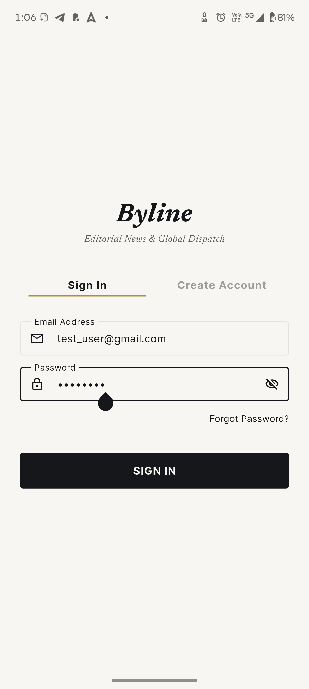 | 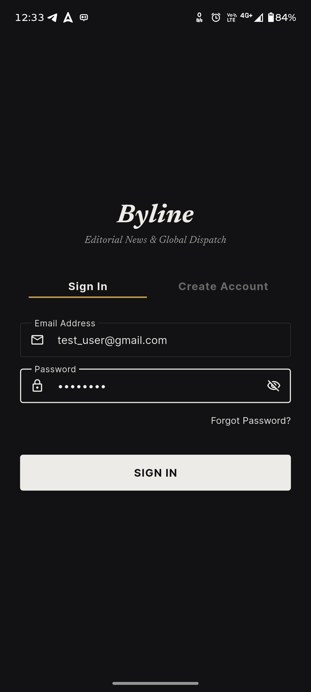 | Sign in / sign up with live validation and password reset |
| Home feed | 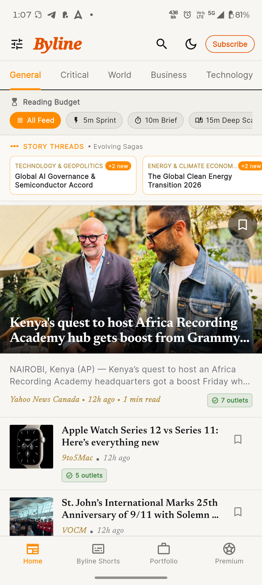 | 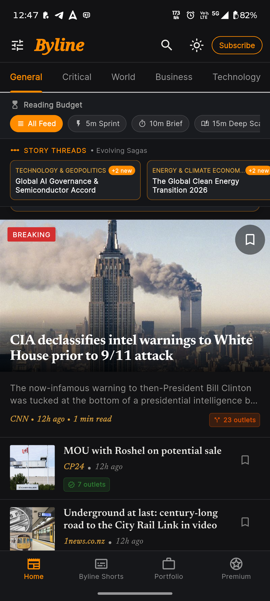 | Daily briefing card, reading budget bar, recommended articles |
| Article detail | 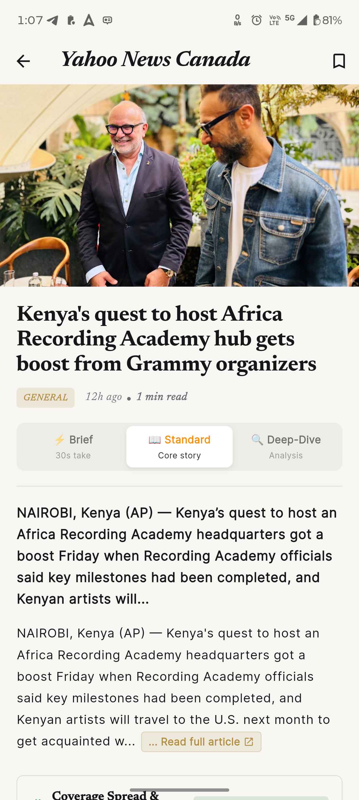 |  | Full article with coverage spread breakdown and the depth toggle |
| Bookmarks | 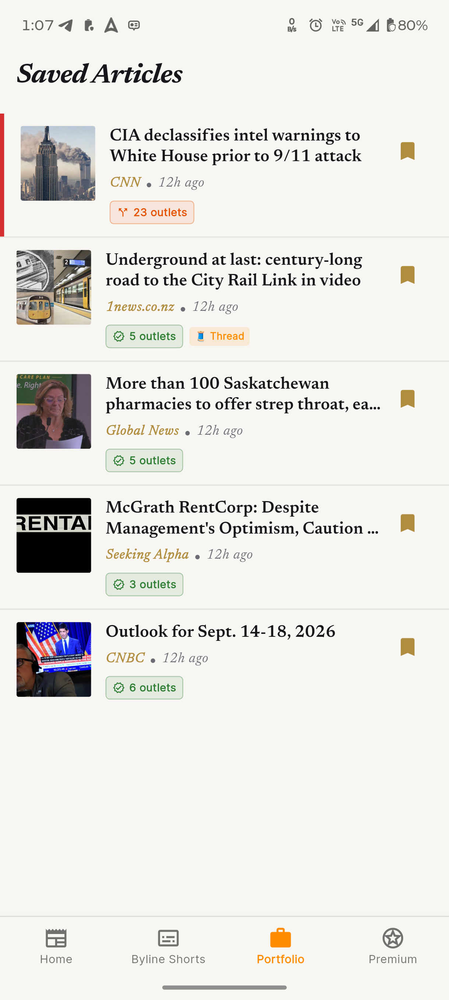 | 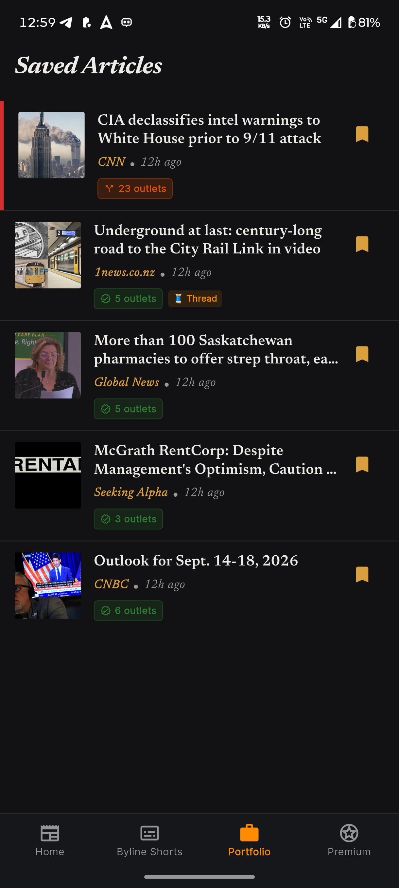 | Saved articles for later reading |
| Search | 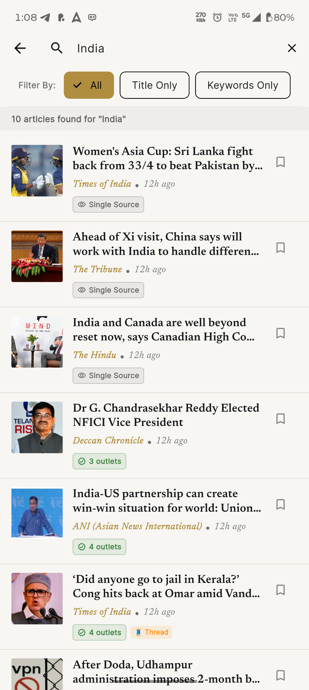 | 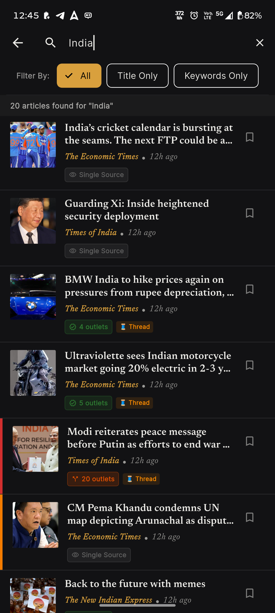 | Live search with title/keyword filter chips |
| Story threads |  | 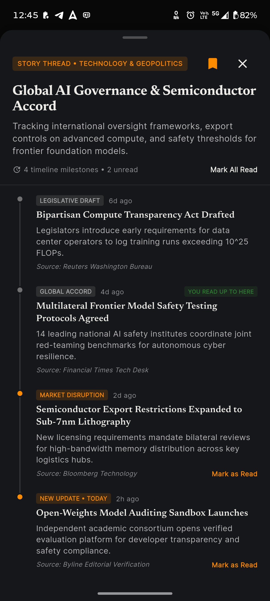 | The narrative timeline and multi-outlet bottom sheet |
| Audio briefings | 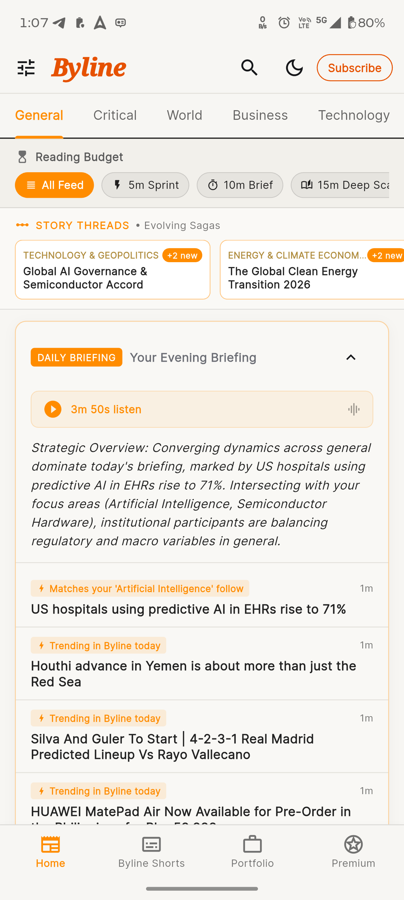 | 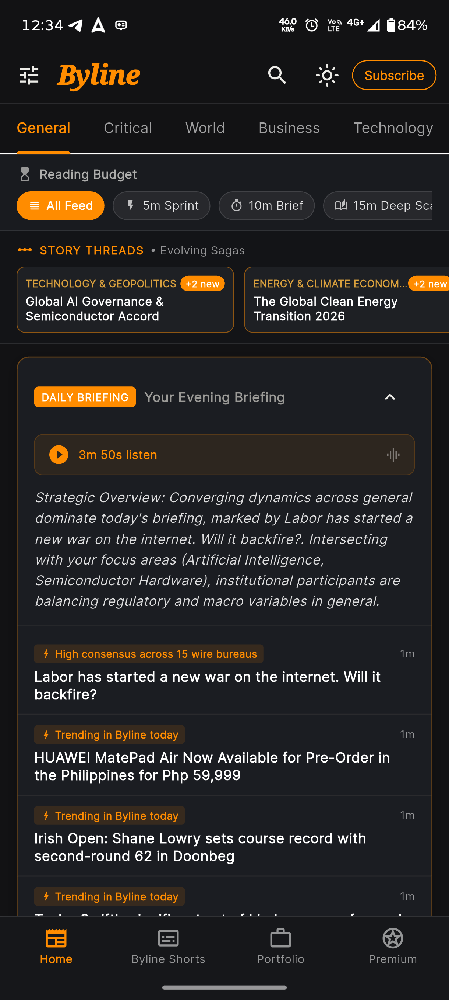 | Playback controls and the shorts (bite-sized summary) view |


---

## Tech stack

| Category | What I used |
|---|---|
| Framework | Flutter (Dart, ^3.13.3) |
| State management | provider ^6.1.2 |
| Networking | dio ^5.7.0 (GNews API v4) |
| Routing | go_router ^14.6.2 |
| Auth & backend | firebase_auth, cloud_firestore |
| Local storage | hive, hive_flutter |
| Secure storage | flutter_secure_storage |
| Text-to-speech | flutter_tts |
| Config | flutter_dotenv |
| Typography | google_fonts |
| Codegen | freezed, json_serializable, hive_generator |

---

## How it's organized

MVVM, split by feature:

```
lib/
├── app_router.dart          # GoRouter setup
├── main.dart                # Entry point, provider tree, orientation lock
│
├── core/                    # Theme, constants, shared widgets, error types
├── models/                  # Article, DailyBriefing, StoryThread, UserInterestProfile, etc.
├── services/                # API calls, Hive, Firebase, TTS, recommendation scoring, tokens
├── viewmodels/               # Feed, search, onboarding, reading budget, story threads, theme
└── views/                   # Home, article, auth, bookmarks, onboarding, search, shorts, splash, profile
```

---

## 📥 Download & Install APK

Pre-compiled release APKs are available directly in the [`releases/`](releases/) directory:

| Targeted Device / Architecture                  | APK File Name                         | Size            | Direct Download Link                                         |
| :---------------------------------------------- | :------------------------------------ | :-------------- | :----------------------------------------------------------- |
| 📱 ****Android ARM64**** **(Optimized & Fast)** | `Byline-Realme-arm64-v8a-release.apk` | ****21.0 MB**** | [Download APK](releases/Byline.apk) |

**### 🚀 How to Install on your Android Phone:**

1. Download [`Byline-Realme-arm64-v8a-release.apk`](releases/Byline.apk) onto your phone.

2. Open the downloaded APK and tap ****Install****. If prompted, allow ****Install from unknown sources**** for your browser or file manager.

3. Open ****Byline**** and register with a test account.


### ⚙️ Build Command from Source:
```bash
# Build optimized ARM64 release APK for Realme devices
flutter build apk --release --split-per-abi

# Or build universal release APK
flutter build apk --release
```

**Minimum Android Version**: Android 5.0 (API level 21).

---

## Running it locally

```bash
git clone <repository-url>
cd byline
flutter pub get
```

Create a `.env` file at the project root:

```env
GNEWS_API_KEY=your_gnews_api_key_here
```

```bash
flutter analyze --no-pub
flutter test --no-pub
flutter run
```

---

## Trying it out

No seeded demo account — sign up directly on the login screen with any valid email/password (e.g. `test_user1@gmail.com` / `Test@1234`). Firebase Auth handles registration.

---

## Where I cut corners, on purpose

- **GNews free tier caps at 100 requests/day** — Hive caching keeps the app usable offline once that's hit.
- **Audio quality depends on the device's own TTS engine** — voice/accent varies by platform.
- **Portrait locked intentionally** — better for long-form reading.
- **Account creation needs a live connection** — no offline sign-up path yet.

With more time: an offline-first sign-up queue, and more nuance in the recommendation decay curve beyond the current fatigue rule.

---

## Testing

63 unit and widget tests covering recommendation scoring, search filtering, auth validation, JWT parsing, the severity classifier, login validation, filter chip interactions, splash branding, and the delete-account flow.

```bash
flutter test --no-pub
```

---

